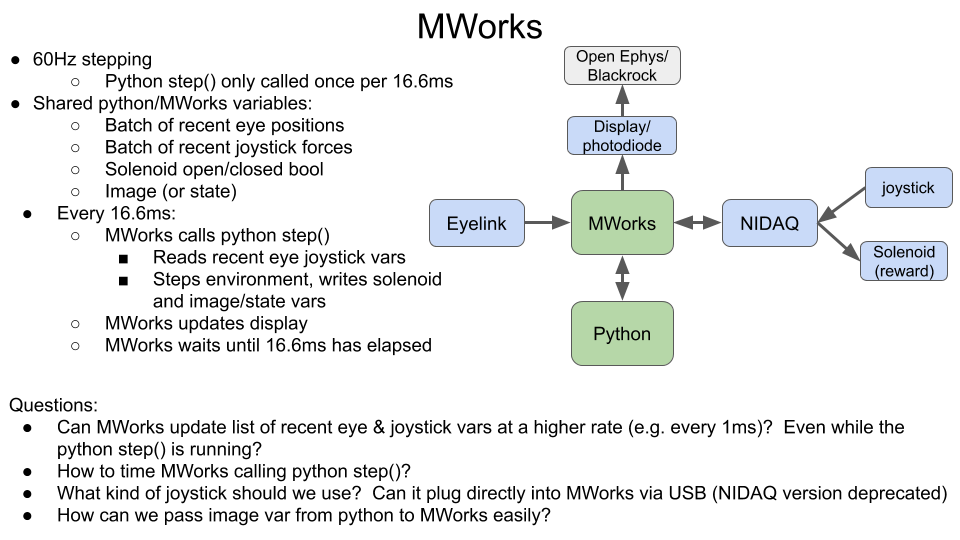

# Dummy Task

This directory contains a dummy joystick task and a demo script to play it. The task interface is the same as the interface for our python-based game environment that we use to train neural nets on.

The task is in `task.py`. The goal of the task is to bring the red triangle (controlled by the joystick) to the red square, and look at the green square. If the red triangle is close enough to the blue square and the eye position is close enough to the green square, a reward is given and a new trial begins.

You can play this task by running `run_demo.py`. You'll need the following installed:
```
pip install numpy
pip install matplotlib
```

Upon running the demo, a plot window will appear showing the environment. You take actions (joystick force and eye position) by clicking with the mouse on the plot. Each step you'll click on the plot twice. The first click is the joystick force (relative to the center of the screen) and the second click is the eye position. It's a little annoying to have to remember quick click is which, but the command line prompts you and after a couple trials you get the hang of it.

This task is a very silly task --- it's only meant to demonstrate a task where both joystick force and eye position are used.

The main method of the task is `.step(action)`, which takes in an action (dictionary with keys `joystick_pos` and `eye_pos`) and returns a reward and an image. The reward is intended to indicate in milliseconds how long to activate the solenoid.

We'd like to run this task at 60Hz in MWorks, using MWorks as the hub connecting all the data streams and running python under the hood. We'd like to collect Eyelink and joystick data faster (maybe 500Hz or 1000Hz), i.e. MWorks has a variable with the recent history (maybe past 20ms) of joystick force and eye position, and python reads these list variables and takes the mean. We're happy to change things on the python side (i.e. create a wrapper over the task class) as necessary.

Here is the slide I showed in our meeting showing the general setup:
